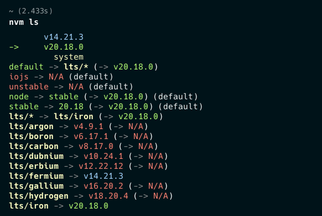

# OTGLite = Online Txt Grabee(short for "Grab Bee"):bee: Lite Edition

[](https://www.deepin.org/) &nbsp; [](https://nodejs.org/)

## Intro

Fetch content from web page, then save to SQLite3 database or save as TXT file(s), including a simple txt file management, db management and logging file. All of all, it is a **Page Crawler** 🔍 powered by node.js. 😊

- `OS`: **Deepin OS v15 ~ v23**

- `Node.js`: **v14 (lts/fermium) ~ v20 (lts/iron)** with `nvm` [Node Version Manager](https://github.com/nvm-sh/nvm)

> PS: Newer version of Node,js might be incompatible.

- `Express v4`

- `JQuery v3`

- SQLite3 management package: `better-sqlite3 v5 (Upgraded to v11)`

### Run, Dev and Node.js Version Mangement

#### Run and Dev

```shell
npm start          # Start web server with node

nvm run dev        # Start web server with nodemon, for development
```

#### Install Nodemon Globally

```shell
npm install -g nodemon
```

#### Node.js Version Mangement (Simple usgae of 'nvm')

```shell
nvm install 14          # Install node v14.21.3 (lts/fermium)

nvm use 14              # Change to node version v14.x.x

nvm use node            # Change to default node version

nvm ls                  # List installed (and current using) node versions on your personal computer
```

#### Tested on Node.js v20.18.0 (lts/iron)

[](https://github.com/nvm-sh/nvm)

## Milestone

- Lastest Modified Date: 9 Oct 2024

- Release Date : 22 Dec 2018

- Project Start Date : 08 Dec 2018
